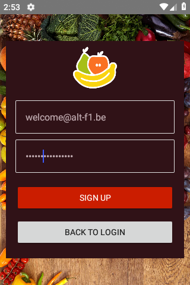
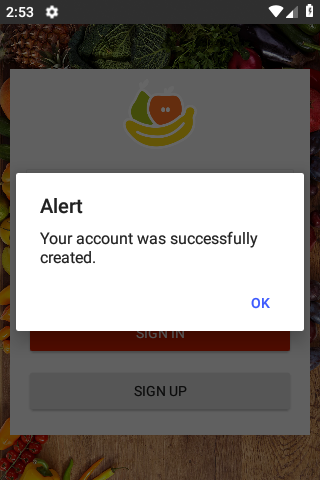
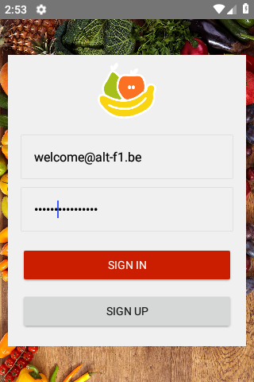
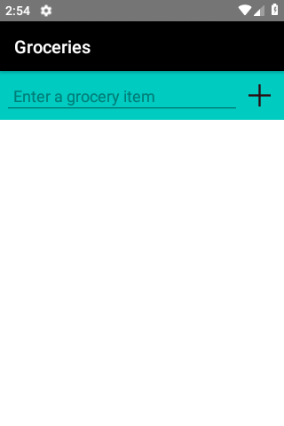
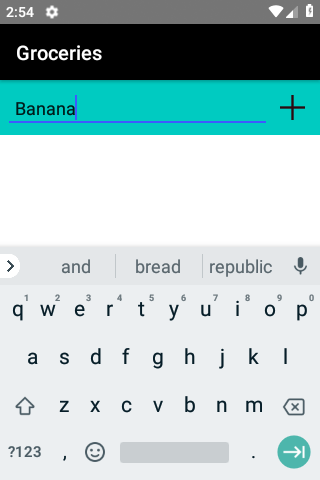
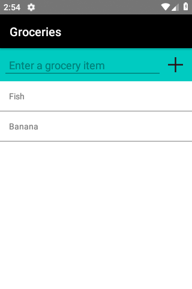
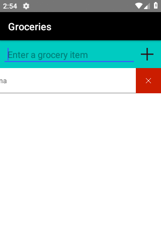

# Groceries list Progressive Web App using NativeScript and Angular6s

Groceries list using Progressive Web App technologies : nativescript, angular, html, css

Test the application on Android : <https://play.google.com/store/apps/details?id=be.altf1.groceriesngpwa>

Heavily based on NativeScript [sample groceries](https://github.com/NativeScript/sample-Groceries)

* Source code : <https://play.nativescript.org/?template=groceries-ng&tutorial=groceries-ng&autoStart=true&id=ak8McE&v=9>

## Build the application on Android

* documentation <https://docs.nativescript.org/angular/start/cli-basics>
  * run the app using native playground : `tns preview`
  * run the app on android : `tns run android` (wait >15 minutes before the app is compiled and uploaded on the Android virtual machine)

## Android publishing requires the signature of the app 

* [Publishing a NativeScript Android App in Google Play](https://docs.nativescript.org/tooling/publishing/publishing-android-apps)
* [Create a key store (certificate) to deploy the Android app on the Google store](https://developer.android.com/studio/publish/app-signing#signing-manually)

1. Generate the certificate : 
    * `keytool -genkey -v -keystore my-release-key.jks -keyalg RSA -keysize 2048 -validity 10000 -alias my-alias`
    1. not required : upgrade the certificate : 
        * `keytool -importkeystore -srckeystore my-release-key.jks -destkeystore my-release-key.jks -deststoretype pkcs12`
2. Build the android app using the certificate : 
    * `tns build android --release --key-store-path my-release-key.jks --key-store-password aStorePasswordToChange --key-store-alias my-alias --key-store-alias-password aPasswordToChange`
3. Build the android app WITHOUT the certificate : 
    * `tns build android`

## Screenshots

